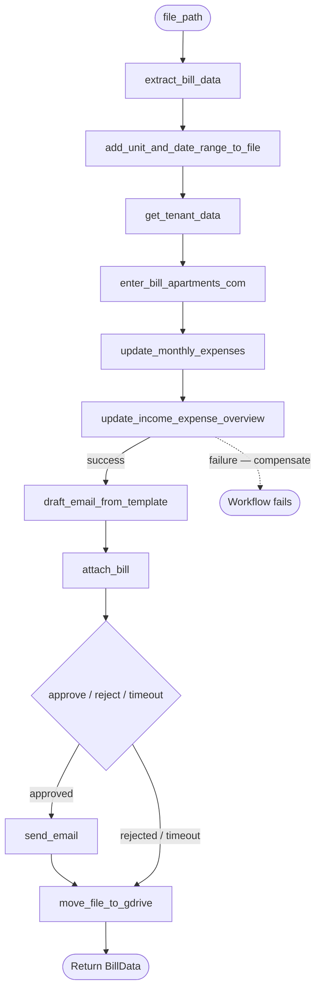

# Bill Processor — Workflow Design

## Overview

A single flat `BillProcessorWorkflow` orchestrates all activities sequentially.
No child workflows — this is a basic Temporal sample demonstrating core concepts:
`@workflow.defn`, `@activity.defn`, `execute_activity`, retry policies, signals,
`wait_condition`, and the saga compensation pattern.

```
BillProcessorWorkflow
├── extract_bill_data
├── add_unit_and_date_range_to_file
├── get_tenant_data
├── enter_bill_apartments_com       ← saga begins
├── update_monthly_expenses         ┐
├── update_income_expense_overview  ┘ atomic pair — saga ends
├── draft_email_from_template       ┐
├── attach_bill                     │ courtesy — best effort
├── [human review signal gate]      │ approve/reject/timeout
├── send_email                      ┘ skipped if not approved
└── move_file_to_gdrive                 best effort
```

## Diagram



## Workflow Configuration

| Setting | Value |
|---|---|
| Task queue | `bill-processor` |
| Namespace | `default` |
| Workflow ID | `bill-<sanitized-filename>` (e.g. `bill-unit104_nov-dec-2024.pdf`) |
| ID reuse policy | `ALLOW_DUPLICATE_FAILED_ONLY` — prevents re-processing a successfully completed bill; allows retry after failure |
| Execution timeout | None — the workflow is expected to complete within a single run |

The Workflow ID is derived deterministically from the input file name so that
re-triggering `run_workflow.py` on the same file is safe: the server will reject
a duplicate start if a successful execution already exists within the retention period.

## Workflow Return Value

On success the workflow returns the final `BillData` (with the fully resolved
`processed_file_name`). This makes the result visible in the Temporal UI and
accessible to the caller of `run_workflow.py` without a separate query round-trip.

On failure the workflow raises the original exception after running any
applicable compensations.

## Activity Sequence & Failure Model

### File Processing

| # | Activity | Retry? | On Retry Exhaustion |
|---|---|---|---|
| 1 | `extract_bill_data` | No | Manual intervention — stop |
| 2 | `add_unit_and_date_range_to_file` | Yes | Stop |

`extract_bill_data` is `NO_RETRY` because parsing failures are deterministic
(a corrupt or unrecognised PDF will not self-heal on retry).

### Property Management (Apartments.com)

| # | Activity | Retry? | On Retry Exhaustion |
|---|---|---|---|
| 3 | `get_tenant_data` | Yes | Fast fail — stop |
| 4 | `enter_bill_apartments_com` | Yes | Fast fail — stop |

`get_tenant_data` resolves the unit number extracted from the bill to a canonical Apartments.com tenant. In production, the extracted unit label (e.g. "Unit 104", "Apt. 104") may not match how Apartments.com identifies the unit, so this activity performs a config-driven lookup — a "unit registry" maintained in Google Sheets maps extracted labels to Apartments.com unit IDs. For this exercise the activity is a stub returning hardcoded data, but the separation is intentional: keeping resolution out of `enter_bill_apartments_com` means the entry logic never has to reason about label normalisation.

### Accounting (Google Sheets)

| # | Activity | Retry? | On Retry Exhaustion |
|---|---|---|---|
| 5 | `update_monthly_expenses` ¹ | Yes | Compensate |
| 6 | `update_income_expense_overview` ¹ | Yes | Compensate |

¹ Both must succeed — if either exhausts retries, compensate both plus step 4.

### Notification (GMail) ²

| # | Activity/Step | Retry? | On Exhaustion/Decision |
|---|---|---|---|
| 7 | `draft_email_from_template` | Yes | Log & continue |
| 8 | `attach_bill` | Yes | Log & continue |
| 8.5 | **Human review** (signal gate) | — | Timeout or rejection → skip `send_email`, continue |
| 9 | `send_email` | Yes | Log & continue (skipped if review not approved) |

> **Note:** The human review step is not an activity — it is a `workflow.wait_condition()` that
> blocks until an `approve_email` or `reject_email` signal arrives, or until the timeout elapses.

### Archive (Google Drive) ²

| # | Activity | Retry? | On Retry Exhaustion |
|---|---|---|---|
| 10 | `move_file_to_gdrive` | Yes | Log & continue |

² Courtesy only — exhausting retries does not trigger compensation.

**Saga boundary:** Compensations apply only if failure occurs between step 4
succeeding and step 6 completing. Once both Sheets updates succeed, the business
transaction is committed.

**Compensation activities** (run in reverse completion order — last completed step undone first):
- `undo_income_expense_overview(BillData)`
- `undo_monthly_expenses(BillData)`
- `undo_apartments_com_entry(BillData, TenantData)`

**Compensation failure behavior:** If a compensation activity exhausts its
retries, the failure is logged and the remaining compensations continue.
The workflow then re-raises the original failure. This may leave state partially
compensated; manual reconciliation is required in that case.

**Cancellation behavior:** Workflow cancellation (`CancelledError`) is not
caught by the saga `except` block, so compensations will not run on an
explicit cancel. This is acceptable for this POC — a cancelled execution
should be treated as requiring manual cleanup.

## Signal / Query Interface

The following signals and query are registered on `BillProcessorWorkflow` to support the human
review gate in the notification phase.

| Type | Name | Description |
|---|---|---|
| Signal | `approve_email` | Reviewer approves — `send_email` will execute |
| Signal | `reject_email` | Reviewer rejects — `send_email` is skipped |
| Query | `email_review_status` | Returns current review state: `pending`, `approved`, `rejected`, or `timed_out` |

**Timeout:** 5 minutes (`REVIEW_TIMEOUT = timedelta(minutes=5)` — demo value; production would
use hours or days). If no signal arrives within the timeout, the workflow treats it as rejected
and skips `send_email`.

**How to signal** from `run_workflow.py` or any client:

```python
handle.signal(BillProcessorWorkflow.approve_email)
# or
handle.signal(BillProcessorWorkflow.reject_email)
```

## Data Models

```python
@dataclass
class BillData:
    input_file_name: str
    processed_file_name: str
    unit: int
    amount: float
    date_range: str

@dataclass
class TenantData:
    name: str
    email: str
```

## Data Flow

```
extract_bill_data(file_path)              → BillData
add_unit_and_date_range_to_file(BillData) → BillData (updated file name)
get_tenant_data(BillData.unit)            → TenantData
enter_bill_apartments_com(BillData,
                          TenantData)     → confirmation: str
update_monthly_expenses(BillData)         → None
update_income_expense_overview(BillData)  → None
draft_email_from_template(BillData,
                          TenantData)     → draft_id: str
attach_bill(draft_id, BillData)           → None
[wait: approve_email / reject_email signal, or 5 min timeout]
send_email(draft_id)                      → None  ← skipped if not approved
move_file_to_gdrive(BillData)             → None
```

`BillData` is the primary carrier through the workflow. File-processing
activities return an updated copy rather than mutating in place; each
returned value replaces the previous binding in the workflow.

## Retry Policy

| Policy | `maximum_attempts` | Used by |
|---|---|---|
| `NO_RETRY` | 1 | `extract_bill_data` |
| `DEFAULT_RETRY` | 5, 2× backoff, 1 s–1 m | all other activities |

All activities share a single `start_to_close_timeout` of 5 minutes. This
covers the expected upper bound for any individual external call (Sheets API,
Gmail, Google Drive, Apartments.com scraping). If future profiling shows a
specific activity consistently taking longer, it should get its own timeout.

`NO_RETRY` via `maximum_attempts=1` is a POC shortcut. In production,
`extract_bill_data` would raise a typed non-retryable error (e.g.
`PDFParseError`) and `DEFAULT_RETRY` would include a `non_retryable_error_types`
list so that business-rule failures fast-fail immediately without burning retry
attempts.

## Production Considerations

### Idempotency

Two layers of idempotency are already in place:

- **Activity replay** — within a single execution, Temporal records each completed activity result in the event history. If the worker crashes and resumes, completed activities are replayed from history and their code is never re-executed. No double-writes from retries.
- **Workflow ID deduplication** — the Workflow ID is derived from the input file name and the reuse policy is `ALLOW_DUPLICATE_FAILED_ONLY`. Re-triggering the workflow on a file that already completed successfully is rejected by the Temporal server.

The remaining gap is a **re-run after failure**: a new workflow execution started against the same file after a previous execution failed. Each mutating activity would run from scratch against external systems. The fix is a check-before-write pattern in each activity, keyed on `unit + date_range`:

| Activity | Gap | Production fix |
|---|---|---|
| `add_unit_and_date_range_to_file` | Original file path no longer exists if already renamed | Check whether the processed filename already exists; if so, skip the rename and return it |
| `enter_bill_apartments_com` | Could create a duplicate ledger entry | Query for an existing entry before writing |
| `update_monthly_expenses` | Could append a duplicate row | Check the sheet for an existing row before appending |
| `update_income_expense_overview` | Same | Same |
| `draft_email_from_template` | Could create multiple drafts | Search for an existing draft by a bill-keyed subject or label; reuse if found |
| `move_file_to_gdrive` | Source file may already be gone | Check whether the file already exists in Drive before uploading |

`send_email` carries unavoidable at-least-once risk: if the activity fails after Gmail accepts the send but before Temporal records the result, the email will be sent twice on retry. This is acceptable for a best-effort notification; production could mitigate it with a sent-flag stored in the draft metadata.

## File Layout

```
app/
├── workflows.py                  BillProcessorWorkflow
├── run_worker.py                 registers workflow + all activities
├── run_workflow.py               triggers a single workflow execution
├── shared/
│   └── data.py                  BillData, TenantData
└── activities/
    ├── __init__.py               re-exports all activity functions
    ├── file_processing.py        extract_bill_data, add_unit_and_date_range_to_file
    ├── property_management.py    get_tenant_data, enter_*, undo_*
    ├── accounting.py             update_*, undo_*
    ├── notification.py           draft_email_*, attach_bill, send_email
    └── archive.py                move_file_to_gdrive
```
